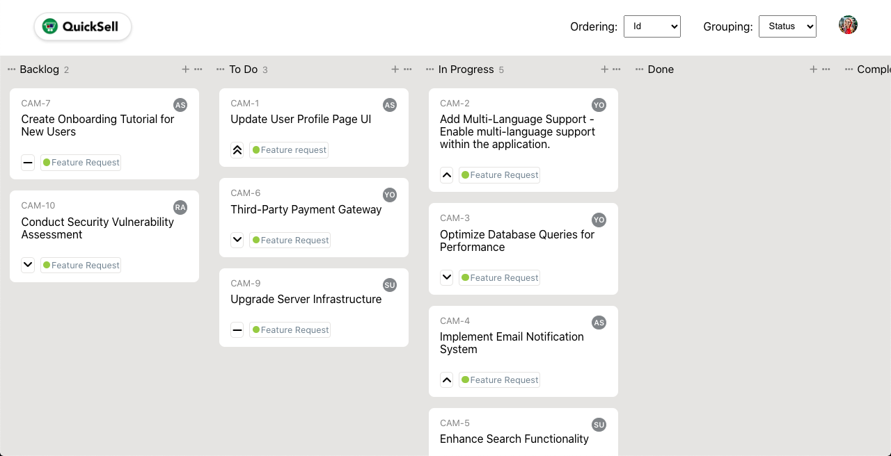
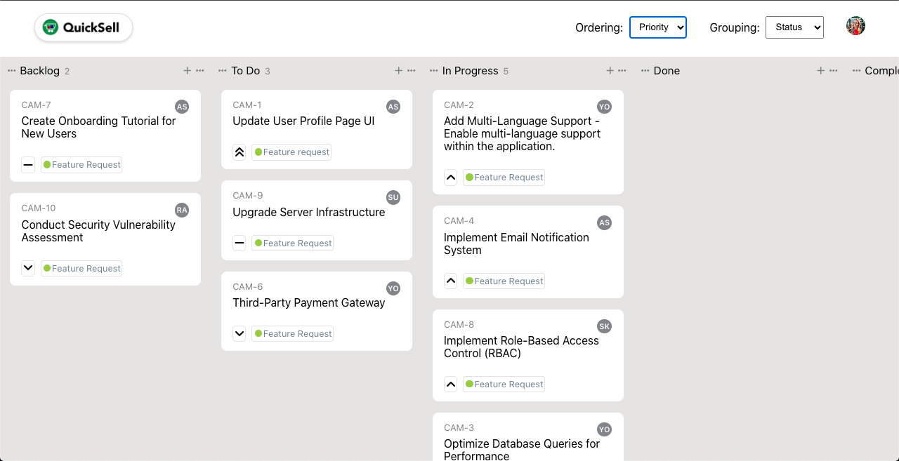
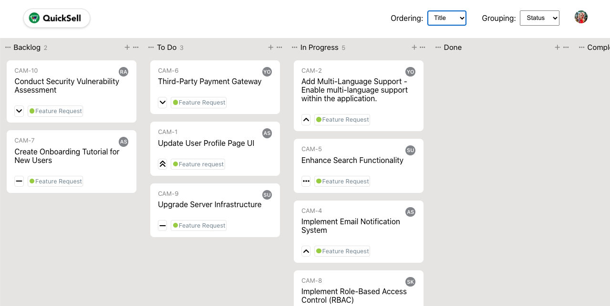
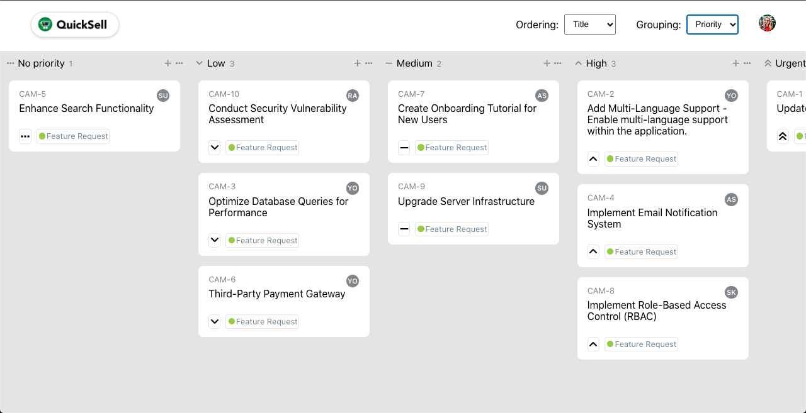
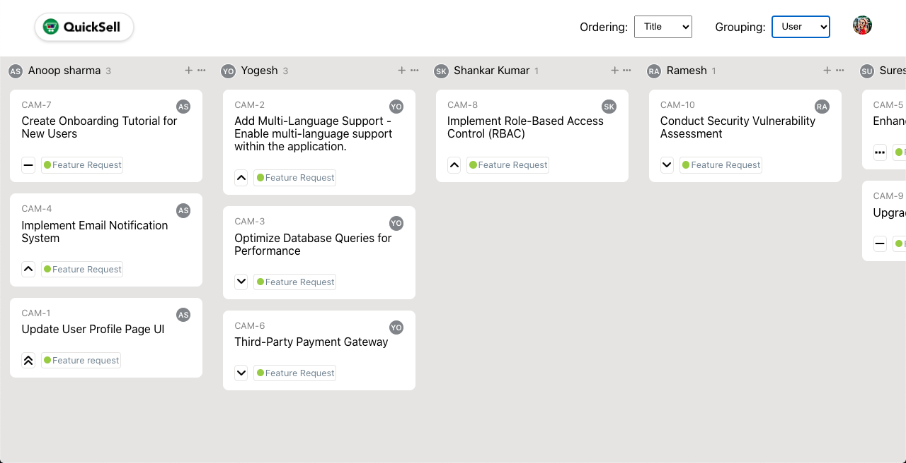

# QuickSell Lead Frontend developer Assignment

This is an assignment submission by Snehangshu Chatterjee for QuickSell for the position of a Lead Frontend Developer. The application reads an endpoint to fetch a list of some tickets, and displays it according to the given [assignment](https://quicksell.notion.site/Lead-Frontend-assignment-fa2f7f8aaada4099916994bad6ec70c2). This project was bootstrapped with [Create React App](https://github.com/facebook/create-react-app). 

## Available Scripts

In the project directory, you can run:

### `yarn start`

Runs the app in the development mode.\
Open [http://localhost:3000](http://localhost:3000) to view it in your browser.

The page will reload when you make changes.\
You may also see any lint errors in the console.

### `yarn build`

Builds the app for production to the `build` folder.\
It correctly bundles React in production mode and optimizes the build for the best performance.

The build is minified and the filenames include the hashes.\
Your app is ready to be deployed!

See the section about [deployment](https://facebook.github.io/create-react-app/docs/deployment) for more information.

### `yarn eject`

**Note: this is a one-way operation. Once you `eject`, you can't go back!**

If you aren't satisfied with the build tool and configuration choices, you can `eject` at any time. This command will remove the single build dependency from your project.

Instead, it will copy all the configuration files and the transitive dependencies (webpack, Babel, ESLint, etc) right into your project so you have full control over them. All of the commands except `eject` will still work, but they will point to the copied scripts so you can tweak them. At this point you're on your own.

You don't have to ever use `eject`. The curated feature set is suitable for small and middle deployments, and you shouldn't feel obligated to use this feature. However we understand that this tool wouldn't be useful if you couldn't customize it when you are ready for it.

## Screenshots

## Deviations

I have deviated from the given design at one place. As visible in the above screenshots, Insstead of having one dropdown which displays the option to select Grouping and Ordering of the tickets, I have displayed them as separate dropdowns. These serve the follwing purposes:

- Reduces the number of clicks that the user has to do for doing the function (from 2 clicks to 1 click)
- The header would have been empty otherwise, which was not looking aesthetically pleasing

## Improvements

There are a lot of things that could have been improved if I had more time, for instance adding Unit Tests to the application. 